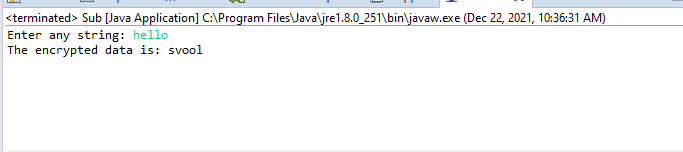

# Program 3

## Aim of the Program

Write a Java program to perform encryption and decryption using the following
algorithms
a. Ceaser Cipher
b. Substitution Cipher
c. Hill Cipher

### Output
#### a. Ceaser Cipher

#### b. Substitution Cipher

#### c. Hill Cipher

